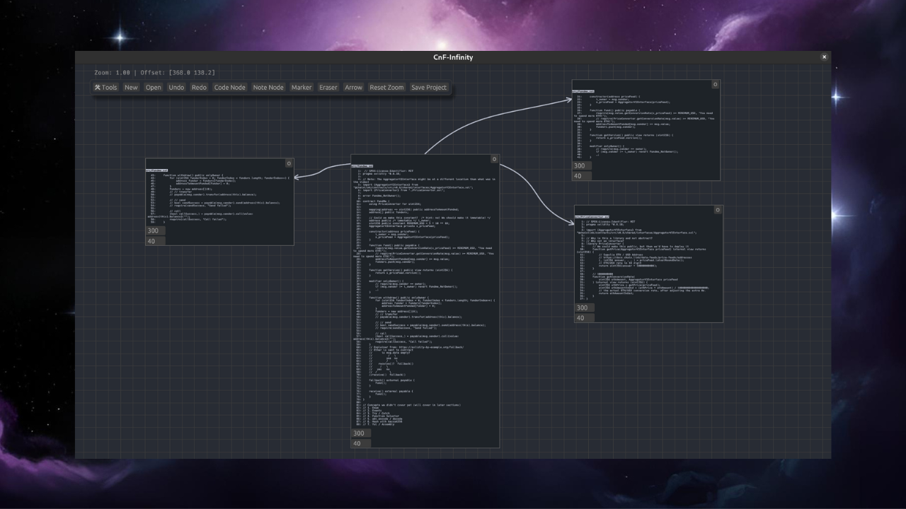

# CnF-Infinity



CnF-Infinity is a Rust-based, canvas-driven application designed for managing and linking notes and code. It provides a flexible interface to create, edit, and connect nodes with arrows, annotate with marker strokes, and track changes with robust undo/redo functionality. The project state is persistently saved so that you can continue your work later.

> **Inspired by [Goosecode](https://goosecode.app/)**
>
> CnF-Infinity was developed as an alternative to Goosecode because Goosecode lacked a native version for Linux. This project brings a similar infinite canvas experience to Linux users, while being open-source and cross-platform.

## Features

- **Canvas-Based Interface:**  
  Easily create and manipulate note and code nodes on a resizable canvas.

- **Node Connections:**  
  Connect nodes with curved arrows to represent relationships and dependencies.

- **Marker and Eraser Tools:**  
  Draw freehand annotations and erase them when needed.

- **Undo/Redo Functionality:**  
  Snapshot-based undo and redo allow you to revert state changes seamlessly.

- **Persistent Storage:**  
  Save your project—including full history of snapshots—to disk for later retrieval.

- **Cross-Platform Compatibility:**  
  Built with Rust and egui, CnF-Infinity is designed to run efficiently on Linux, Windows, and macOS.

## Installation

Download pre-built binaries from the [Releases page](https://github.com/0xh4ty/CnF-Infinity/releases/tag/v1.0.0-beta.1).

## Usage

Run the binary for your platform. No installation required.

### Running from Source

To clone the repository and build the application from source:

```bash
git clone https://github.com/0xh4ty/CnF-Infinity.git
cd CnF-Infinity
cargo run --release
```

### UI Overview

- **Node Creation:**  
  Use the toolbar to create new note nodes or code nodes.  
  Nodes are positioned relative to your current view in a circular pattern.

- **Connections:**  
  Enable arrow mode to connect nodes with curved arrows.  
  Click on a node to start an arrow, then click on another to complete the connection.

- **Annotations:**  
  Use marker and eraser tools to annotate your canvas.

- **Undo/Redo:**  
  Utilize the undo and redo buttons to revert or reapply changes.

- **Saving:**  
  Save your project along with its full undo/redo history to storage.

## Contributing

Contributions, bug reports, and feature requests are welcome!  
Feel free to open an issue or submit a pull request to help improve CnF-Infinity.

## License

This project is licensed under the MIT License. See the [LICENSE](LICENSE) file for details.
